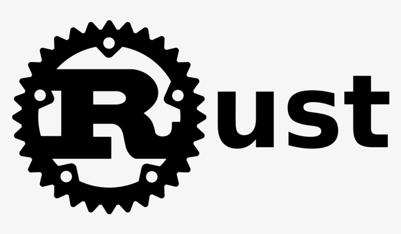

[](https://www.rust-lang.org)


## Banco de Dados

```sh
# Iniciando o DB
docker run --rm -p 5432:5432 -e "POSTGRES_PASSWORD=postgres" --name pg postgres:14

# Optional psql (outro terminal )
docker exec -it -u postgres pg psql
```

## Dev Test

```sh
cargo watch -q -c -w src/ -x 'test model_db_ -- --test-threads=1 --nocapture'
```

## Tokio library

- Um runtime  para escrever aplicativos confiáveis, assíncronos e finos com a linguagem de programação Rust. De forma que:

1. Rápido: as abstrações de custo zero do Tokio oferecem desempenho bare-metal.

2. Confiável: Tokio aproveita a propriedade, o sistema de tipos e o modelo de simultaneidade do Rust para reduzir bugs e garantir a segurança do thread.

3. Escalável: Tokio tem uma pegada mínima e lida com contrapressão e cancelamento naturalmente.


## futures-rs

- futures-rs é uma biblioteca que fornece as bases para programação assíncrona em Rust. Ele inclui definições de características-chave como Stream, bem como utilitários como join!, select! e vários métodos combinadores de futuros que permitem um fluxo de controle assíncrono expressivo.